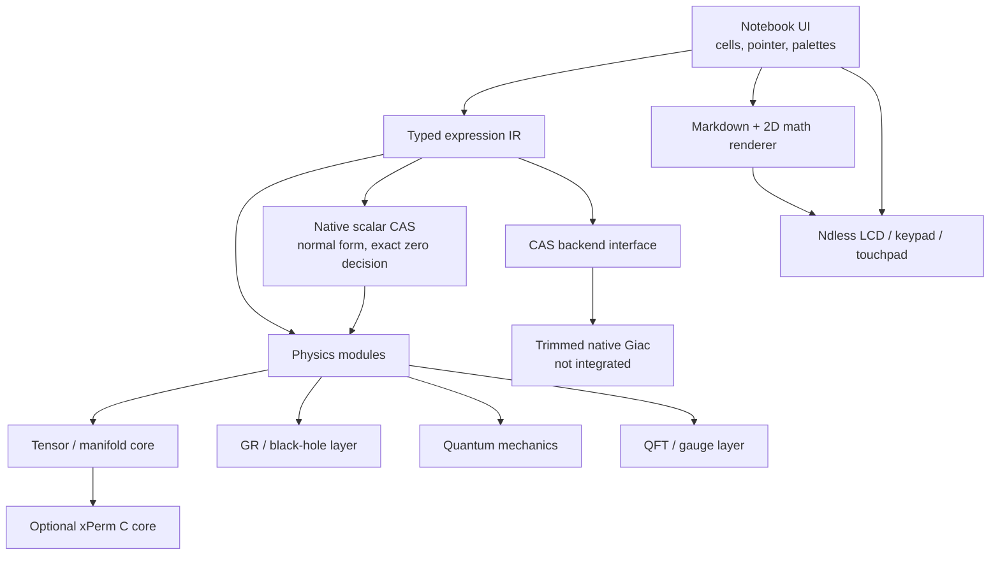

# Native architecture

## System shape

Phy-nspire is one Ndless-native ARM C/C++ application. The production runtime
does not execute through TI Lua.

## Components

### Platform layer

The platform boundary owns the CX II framebuffer, touchpad sampling, keypad,
clock, filesystem, allocation telemetry, and clean shutdown. The initial source
reference is nMarkdown's already-tested Ndless platform adapter.

### Notebook shell

The main viewport is a scrollable sequence of cells:

- Markdown;
- editable mathematical input;
- symbolic output;
- tables/matrices;
- diagrams;
- warnings and resource-limit results.

Pointer hit-testing, focus, menus, palettes, selection, and scrolling are
native. A computation never blocks input indefinitely: long operations expose
progress and a cancellation path.

### Rendering

The renderer starts from the reusable portions of nMarkdown:

- RGB565 primitives;
- FreeType/HarfBuzz text;
- bounded Markdown parsing;
- bounded mathematical LaTeX layout;
- touchpad and semantic input adapters.

Reader-only features are kept only if they serve notebook cells. Full CJK fonts
remain optional external assets until the installed-size accounting rule is
settled.

### Expression IR

Physics-facing code operates on a compact typed expression graph with stable
node identifiers. Important node kinds include scalar operations, equations,
indices, tensors, derivatives, differential forms, operators, gamma matrices,
group generators, momenta, particles, and graph elements.

The IR owns:

- structural hashing and interning;
- canonical child ordering where multiplication is commutative;
- explicit noncommutative products;
- assumptions and declared symmetries;
- serialization independent of any one CAS backend.

### Scalar rewrite layer

Between the IR and any backend sits a native scalar algebra layer,
`include/phy/cas.h` and `src/cas`, documented in [`docs/CAS.md`](CAS.md). It owns
exact rational arithmetic, the normal form, expansion, substitution,
differentiation, and — the capability the tensor and curvature phases turn on —
an *exact* zero decision that answers "unknown" rather than guessing outside the
class it can decide.

It exists because the operations those phases need are the ones a backend
boundary is worst at: a curvature pass asks "is this component zero?" thousands
of times, and an answer that arrives as a backend string, parsed and
size-checked, is both slower and less trustworthy than one computed on the IR.
The layer is the first and largest instance of the incremental replacement the
narrow boundary below was designed to permit.

### CAS backend

The planned backend is a size-trimmed native Giac library derived from the
working KhiCAS target configuration, for what the layer above does not cover:
integration, limits, series, solving, polynomial factoring, and matrices. It has
not been integrated, and the scalar operations the tensor and general-relativity
phases require no longer wait on it.

The boundary is intentionally narrow:

1. translate an eligible scalar subtree to the backend;
2. run a bounded operation;
3. parse the result back into typed IR;
4. reject outputs that violate size, depth, or type limits.

Tensor, QFT, and gauge semantics do not live inside opaque Giac strings.
Specialized native implementations can therefore replace backend calls
incrementally.

## Data flow

1. Input events edit a source cell or select a palette object.
2. The parser creates typed IR and local diagnostics.
3. The evaluator schedules native physics rewrites and eligible Giac calls.
4. The result is normalized, bounded, and stored as a result cell.
5. The display tree converts the result to two-dimensional layout and optional
   LaTeX.
6. The notebook saves source, declarations, and compact results atomically.

## Performance policy

- Production builds use the Ndless native toolchain, release optimization,
  section garbage collection, and measured LTO where compatible.
- No design depends on overclocking.
- Every module has desktop microbenchmarks and device timing counters.
- Expressions have configurable node, term, recursion, and wall-time limits.
- Large temporaries use arenas or bounded pools to reduce CX II heap
  fragmentation.
- Rendering and evaluation caches have explicit byte ceilings and LRU
  eviction.

## Error handling

Errors are typed values, not strings mixed with valid expressions. Categories
include parse, type, domain, assumption, unsupported, overflow, interrupted,
timeout, node-limit, depth-limit, term-limit, memory-limit, backend, and
corrupt-document errors.

Type, overflow, node-limit, and depth-limit joined the list when the
expression IR landed: a node kind rejecting an operand's kind is not a domain
error, and the three construction ceilings are separately actionable. The
enumeration is `phy_status` in `include/phy/phy.h`; its values are written
into saved documents, so they are appended and never reordered.

The notebook must remain saveable after a failed calculation. A backend crash
or rejected result may invalidate one cell, never the whole document.

## Verification

- Host unit tests for parsing, IR, rewriting, serialization, and each physics
  identity.
- Golden symbolic results cross-checked against Giac and, where relevant,
  Mathematica/xAct/FeynCalc reference notebooks.
- Property tests for dummy-index renaming, contraction, symmetry, and
  coordinate transformations.
- Deterministic 320 × 240 framebuffer fixtures derived from the nMarkdown
  desktop harness.
- Firebird tests for calculator ABI and UI flows where legally available.
- Real CX II smoke, memory, timing, cancel, save/reopen, and reboot/reinstall
  tests before release.
