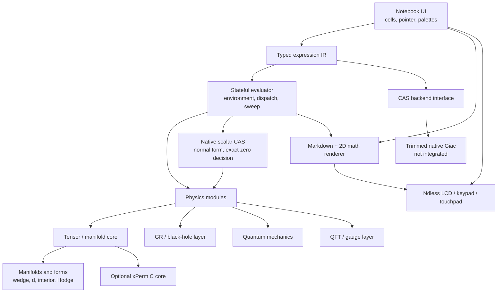

# Native architecture

## System shape

Phy-nspire is one Ndless-native ARM C/C++ application. The production runtime
does not execute through TI Lua.

## Components

### Platform layer

The platform boundary owns the CX II framebuffer, touchpad sampling, keypad,
clock, filesystem, allocation telemetry, and clean shutdown. nMarkdown is a
pinned dependency only for mathematical typesetting; Phy-nspire keeps its own
Ndless display, input, storage, and lifecycle adapters.

### Notebook shell

The main viewport is a scrollable sequence of cells:

- Markdown;
- editable mathematical input;
- symbolic output;
- tables/matrices;
- diagrams;
- warnings and resource-limit results.

Pointer hit-testing, focus, menus, palettes, selection, and scrolling are
native. A computation never blocks input indefinitely: long operations expose
progress and a cancellation path.

The reader-facing source is parsed by an extensible precedence parser and
command registry. It produces typed IR before evaluation; the renderer never
computes from the visible string. A successful input cell stores both its
source and stable IR serialization, so save/reopen can verify their agreement.
See [`SOURCE_LANGUAGE.md`](SOURCE_LANGUAGE.md).

Cells are not independent. They share one evaluator environment, so a cell may
bind a name that later cells read, running one marks every result after it
stale, and a reopened document must be replayed before its bindings exist. See
the evaluator section below.

### Rendering

Rendering has two deliberately separate inputs. The original allocation-free
walker renders trusted typed-IR CAS results directly, while a narrow C++17
bridge renders raw LaTeX embedded in Markdown cells through nMarkdown. The
current combined renderer covers:

- RGB565 primitives and integer-scaled headings;
- semantic Markdown heading/body cards;
- inline `$...$` / `\(...\)` and display `$$...$$` / `\[...\]` formula
  delimiters;
- nMarkdown's bounded LaTeX parser, OpenType MATH layout, Latin Modern Math,
  FreeType/HarfBuzz shaping, and local malformed-formula recovery;
- shared-baseline rows for scalar and physics IR;
- vertical exact fractions;
- raised powers/upper indices and lowered indices;
- functions, products, sums, equations, tensors, operators, and derivatives.

The math dependency is pinned at commit
`936b04854fc0838de9986b4bfee66a4da9db6166` and the combined product is
GPL-3.0. Reader, browser, search, MD4C, pagination, and platform adapters are
not compiled. The next unification step constructs nMarkdown `MathTree`
objects directly from typed IR instead of serializing CAS output to LaTeX.

Reader-only features are kept only if they serve notebook cells. Full CJK fonts
remain optional external assets until the installed-size accounting rule is
settled.

### Expression IR

Physics-facing code operates on a compact typed expression graph with stable
node identifiers. Important node kinds include scalar operations, equations,
indices, tensors, derivatives, differential forms, operators, gamma matrices,
group generators, momenta, particles, and graph elements.

The IR owns:

- structural hashing and interning;
- canonical child ordering where multiplication is commutative;
- explicit noncommutative products;
- assumptions and declared symmetries;
- serialization independent of any one CAS backend.

### Scalar rewrite layer

Between the IR and any backend sits a native scalar algebra layer,
`include/phy/cas.h` and `src/cas`, documented in [`docs/CAS.md`](CAS.md). It owns
exact rational arithmetic, the normal form, expansion, substitution,
differentiation, and — the capability the tensor and curvature phases turn on —
an *exact* zero decision that answers "unknown" rather than guessing outside the
class it can decide.

It exists because the operations those phases need are the ones a backend
boundary is worst at: a curvature pass asks "is this component zero?" thousands
of times, and an answer that arrives as a backend string, parsed and
size-checked, is both slower and less trustworthy than one computed on the IR.
The layer is the first and largest instance of the incremental replacement the
narrow boundary below was designed to permit.

### Tensor and geometry layers

Above the scalar layer sit two component-level physics layers, neither wired to
the UI. `include/phy/tensor.h` and `src/tensor` own charts, dense `n^r`
component storage, and declared slot symmetries, documented in
[`docs/TENSOR.md`](TENSOR.md). `include/phy/geom.h` and `src/geom` own
manifolds — dimension, orientation, signature, borrowed charts — and
differential forms in a chart's coordinate coframe, with exact wedge, exterior
derivative, interior product, and orthonormal/general coordinate-metric Hodge
duals, documented in
[`docs/GEOMETRY.md`](GEOMETRY.md).

The geometry layer is the first physics module to call the scalar layer rather
than only to store handles, which is what makes the narrow CAS contract
load-bearing: its budget, cancellation hook, exact arithmetic and memoization
all apply to a form operation without that operation restating any of them.
`include/phy/yang_mills.h` then composes these forms with the exact finite Lie
algebra layer to implement algebra-valued forms, connections, covariant
derivatives, curvature, gauge variations, Bianchi residuals, and quadratic
Yang--Mills densities without a second expression system.

### Stateful evaluator

`include/phy/eval.h` and `src/eval`, documented in
[`EVALUATOR.md`](EVALUATOR.md), sit between the notebook and every physics
module. They own the notebook environment — names bound to typed values that
outlive the cell that produced them — and the dispatch that turns a reserved
operator head into a backend call.

The layer exists because the alternative had already shipped and was
indistinguishable from working. The notebook accepted `ExteriorD[omega]` and
`FieldStrength[A,g]`, built `PHY_IR_OPERATOR` nodes, and handed them to the
scalar CAS, which by its own contract simplifies an operator's operands and
leaves the node alone. The head survived, nothing computed, and the geometry,
Lie-algebra and Yang--Mills layers below — fully implemented, thousands of
checks each — were unreachable from the product.

Two rules make the replacement checkable rather than aspirational: every
reserved head is either evaluated or a typed error, and nothing is rebuilt as an
inert operator with the same head. The test suite calls a head with no arguments
and requires it to reject, so a name that falls out of either the parser's table
or the evaluator's fails a test instead of silently degrading.

State is required because a manifold, a chart, a connection or a curvature
bundle is not an expression and should not become one. The environment owns
those objects, sweeps unreachable intermediates after every command, and
destroys survivors in the reverse of creation order — which is the order the
layers below require. It is deliberately not serialized: a document stores cell
sources and results, and reopening one replays them.

### CAS backend

The planned backend is a size-trimmed native Giac library derived from the
working KhiCAS target configuration, for what the layer above does not cover:
integration, limits, series, solving, polynomial factoring, and matrices. It has
not been integrated, and the scalar operations the tensor and general-relativity
phases require no longer wait on it.

The boundary is intentionally narrow:

1. translate an eligible scalar subtree to the backend;
2. run a bounded operation;
3. parse the result back into typed IR;
4. reject outputs that violate size, depth, or type limits.

Tensor, QFT, and gauge semantics do not live inside opaque Giac strings.
Specialized native implementations can therefore replace backend calls
incrementally.

## Data flow

1. Input events edit a source cell or select a palette object.
2. The parser creates typed IR and local diagnostics.
3. The evaluator resolves bindings, dispatches reserved heads onto the native
   physics layers, and would schedule eligible Giac calls.
4. The result is a typed value: a scalar, or an object the environment owns. It
   is normalized, bounded, and stored as a result cell together with either its
   typed-IR expansion or its descriptor line.
5. The display tree converts the result to two-dimensional layout and optional
   LaTeX.
6. The target save path writes source, declarations, and compact results
   atomically under `/documents/phy-nspire/notebooks`; loading validates the
   complete versioned, checksummed document before replacing the workspace. The
   environment is not part of the document and is rebuilt by replaying cells.

## Performance policy

- Production builds use the Ndless native toolchain, release optimization,
  section garbage collection, and measured LTO where compatible.
- No design depends on overclocking.
- Every module has desktop microbenchmarks and device timing counters.
- Expressions have configurable node, term, recursion, and wall-time limits.
- Large temporaries use arenas or bounded pools to reduce CX II heap
  fragmentation.
- Rendering and evaluation caches have explicit byte ceilings and LRU
  eviction.

## Error handling

Errors are typed values, not strings mixed with valid expressions. Categories
include parse, type, domain, assumption, unsupported, overflow, interrupted,
timeout, node-limit, depth-limit, term-limit, memory-limit, backend, and
corrupt-document errors.

Type, overflow, node-limit, and depth-limit joined the list when the
expression IR landed: a node kind rejecting an operand's kind is not a domain
error, and the three construction ceilings are separately actionable. The
enumeration is `phy_status` in `include/phy/phy.h`; its values are written
into saved documents, so they are appended and never reordered.

The notebook must remain saveable after a failed calculation. A backend crash
or rejected result may invalidate one cell, never the whole document.

## Verification

- Host unit tests for parsing, IR, rewriting, serialization, and each physics
  identity.
- Golden symbolic results cross-checked against Giac and, where relevant,
  Mathematica/xAct/FeynCalc reference notebooks.
- Property tests for dummy-index renaming, contraction, symmetry, and
  coordinate transformations.
- Deterministic 320 × 240 framebuffer fixtures derived from the nMarkdown
  desktop harness.
- Firebird tests for calculator ABI and UI flows where legally available.
- Real CX II smoke, memory, timing, cancel, save/reopen, and reboot/reinstall
  tests before release.
