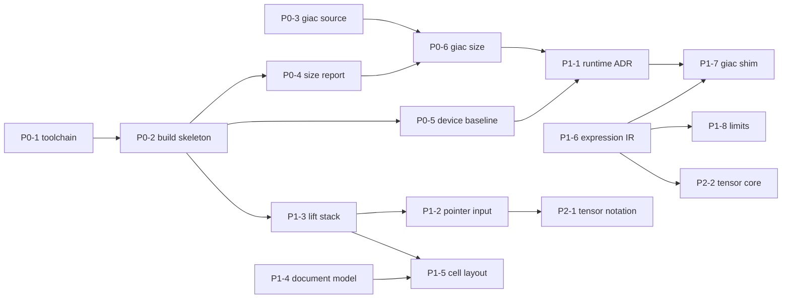

# Task contracts

Date: 2026-07-26

Each contract below is an independently assignable unit of work with a stated
input, a deliverable at named paths, and an acceptance test that a reviewer can
execute without consulting the author. Contracts cite
[`research/REFERENCE_CORPUS.md`](../research/REFERENCE_CORPUS.md) for their
evidence; where a contract and the corpus disagree, the corpus is authoritative
and the contract is a defect.

**Conventions.**

- `§n` refers to a section of the reference corpus.
- "Upstream" means the pinned nMarkdown checkout at
  `936b04854fc0838de9986b4bfee66a4da9db6166`, referenced read-only.
- A contract is *done* only when its acceptance test passes on a clean
  checkout. "It builds on my machine" is not an acceptance test.
- Contracts marked **BLOCKING** gate every downstream phase. Do not begin
  dependent work by assuming their outcome.

**Dependency order.**



---

## Phase 0 — reproducible native baseline

### P0-1 — Provision and pin the Ndless SDK toolchain — **BLOCKING**

**Depends on** nothing. **Evidence** §1, §2.4.

Nothing can be compiled today. The environment has no `nspire-gcc`, no
`arm-none-eabi-gcc`, no `make`, and no `cmake`; `../downloads/ndless-r2022/`
contains calculator-side installer `.tns` files only, not an SDK. There is also
no Ndless git tag named `r2022` — tags stop at `v4.5`, and `r2022` is a
*revision* number of the kind consumed by the Zehn `NDLESS_REVISION_MIN` flag.

**Deliverable**

- `tools/toolchain/README.md` — provisioning steps for Windows (MSYS2) and
  Linux, stating exactly which packages supply `make`, `cmake`, and the ARM
  cross-compiler.
- `research/upstreams.lock.json` gains an `ndless_sdk` entry pinning a commit
  SHA (master HEAD was `9484d8da7c7a4dde9766138c2e42e1d1e3acfcd4` on
  2026-07-06), plus the minimum Ndless version and revision the project will
  declare in its Zehn flags.
- A `tools/toolchain/verify.sh` that prints the resolved version of every
  required tool and exits non-zero if any is missing.

**Acceptance** — On a machine with no prior setup, following
`tools/toolchain/README.md` makes `tools/toolchain/verify.sh` exit 0, and
`nspire-gcc --version` and `genzehn --help` both succeed.

**Out of scope** — Building any Phy-nspire source.

---

### P0-2 — Host and ARM build skeleton

**Depends on** P0-1. **Evidence** §5, §10 U5.

Mirror upstream's two-build-system split — CMake for host tests, a separate
`Makefile.ndless` for the device — because they carry incompatible flag sets
and upstream keeps them apart for that reason.

Upstream device flags to start from (`Makefile.ndless:80-90`):

```
CFLAGS   := -std=c99   -Os -Wall -Wextra -marm -ffunction-sections -fdata-sections
CXXFLAGS := -std=c++17 -Os -Wall -Wextra -Wpedantic -marm \
            -ffunction-sections -fdata-sections -fexceptions -fno-rtti
LDFLAGS  := -Wl,--gc-sections
ZEHNFLAGS := --ndless-min 31 --ndless-rev-min 2004 --clickpad-support true \
             --color-support true --uses-lcd-blit true --compress
```

Note `-fexceptions`: upstream **requires** exceptions, so a global
`-fno-exceptions` build is not available. This constrains P1-1.

**Deliverable** — `CMakeLists.txt` (host, tests, desktop harness),
`Makefile.ndless` (device), a top-level `Makefile` dispatching to both, and one
trivial source file compiled by both.

**Acceptance**

1. `make test` builds and runs at least one host test on a machine with no
   Ndless SDK installed.
2. `make ndless` produces `build/ndless/phynspire.tns`.
3. The build is reproducible: two clean builds yield byte-identical `.tns`.
4. **LTO probe (settles §10 U5):** a documented attempt to add `-flto` records
   in `docs/adr/` whether it links, and if not, the exact failure. Do not leave
   LTO as an unexamined aspiration.

---

### P0-3 — Acquire and pin buildable Giac source — **BLOCKING**

**Depends on** nothing. **Evidence** §2.2, §8, §10 U1, §10 U3.

`khicas52.zip` ships binaries only. Its GPL source offer points at
`www-fourier.univ-grenoble-alpes.fr`, which together with `wfourier.u-ga.fr`
was unreachable from this environment on 2026-07-26 (curl code 000 for all
three probed URLs). The project's only CAS supply line currently runs through a
single unmirrored university web host.

Verified-reachable alternates: `sources.debian.org` (giac
`1.9.0.93+dfsg2-4`, `1.9.0.35+dfsg2-1.1`, `1.4.9.69+dfsg1-2`, …),
`sourceforge.net/projects/xcas/files/`, and
`github.com/KhiCAS/ti-ce-giac` (calculator-trimmed, giac 1.4.9, **eZ80
target** — `config.h` sets `SIZEOF_INT 3`).

**Deliverable**

- A chosen Giac source tarball mirrored into a pinned, hashed artifact, with
  its SHA-256 and provenance in `research/upstreams.lock.json`.
- `research/giac-provenance.md` recording: the version chosen, why, whether a
  Debian `+dfsg` repack stripped anything the project needs, and the best
  available answer to §10 U3 (which Giac version the 2024-07-06 `khicas.tns`
  was built from).
- A first pass at §10 U1: does the chosen source's calculator configuration use
  GMP/MPFR, or `USE_GMP_REPLACEMENTS` + `HAVE_LIBTOMMATH`?

**Acceptance** — The tarball's recorded hash matches on re-download from the
mirror, `giac-provenance.md` answers U1 with a file-and-line citation, and the
GPL source-offer obligation (§9) is satisfiable from repository contents alone.

**Out of scope** — Compiling Giac. That is P0-6.

---

### P0-4 — Size and symbol report tooling

**Depends on** P0-2. **Evidence** §3, §4.

Upstream has no size-report target; `docs/ROADMAP.md` Phase 0 requires one.
Because every `.tns` is a zlib-compressed Zehn image, a flash-size number alone
is misleading — the resident image is 1.68×–2.07× the compressed size.

**Deliverable** — `tools/size/zehn_report.py` (or equivalent) that parses a
`.tns` and emits, per artifact:

| Metric | Source |
| --- | --- |
| container bytes | file length |
| `file_size`, `alloc_size`, `reloc_count`, `flag_count`, `extra_size` | `Zehn_header`, `ndless-sdk/include/zehn.h` |
| resident image | `alloc_size − tables` |
| zlib staging buffer | `file_size − tables` |
| reloc table bytes | `4 × reloc_count` |
| **peak at load** | sum of the previous three |

where `tables = 32 + 4·reloc_count + 4·flag_count + extra_size`, matching
`zehn_loader.cpp`'s `nuc_ftell(file) - file_start`. The peak must be the sum of
all three, because the loader holds them live simultaneously:
`execmem_alloc(remaining_mem)` at `zehn_loader.cpp:122`, then
`Storage<uint8_t> compressed(remaining_file)` at line 138, then `uncompress()`
at line 146.

Also emit a top-50 symbol size table from the `.elf` via `nm`/`size`.

**Acceptance** — Run against the pinned reference binaries, the tool reproduces
these exact values:

| Artifact | Resident image | Peak at load | `reloc_count` |
| --- | ---: | ---: | ---: |
| `khicas.tns` | 8,574,520 | 12,700,111 | 83,424 |
| `nmarkdown.tns` | 2,130,052 | 3,386,780 | 7,485 |

`make size-report` prints the table and fails the build if resident image
exceeds 12 MiB or peak exceeds 20 MiB (§4).

---

### P0-5 — Native framebuffer baseline on real hardware

**Depends on** P0-2. **Evidence** §7, §10 U4.

Upstream never measured on-device timing — `README.md` §"Compatibility
boundaries": "peak memory and the provisional CX timing targets still require
measurement on each supported calculator model". `docs/ARCHITECTURE.md`'s claim
that "every module has … device timing counters" is inherited aspiration.
Phase 0 must produce the first real numbers.

Lift for this contract, unchanged: `DisplayNdless`,
`include/nmarkdown/platform/ndless/display_sync.h` (the
`stage_landscape_rgb565_for_native()` rotation and the `VerticalCompareEdge`
state machine that rejects a stale latched vertical-compare bit before
`lcd_blit`), `ClockNdless`, and `Surface565`.

**Deliverable** — A `.tns` that initializes the framebuffer, draws a known test
pattern, samples the clock, responds to one key, and exits restoring the OS
display mode.

**Acceptance** — On a real CX II CAS running OS 6.4.0.74 with Ndless r2022:

1. Launch and exit leave no display corruption; the OS screen is restored.
2. Reported: milliseconds for `present()` (mean and peak over 100 frames),
   milliseconds from launch to first pixel, and resident RAM at steady state.
3. Numbers land in `research/device-baseline-<date>.md`, and §10 U4 is closed.
4. A reboot-and-relaunch cycle behaves identically.

---

### P0-6 — Trimmed Giac static-library size report — **BLOCKING**

**Depends on** P0-3, P0-4. **Evidence** §4, §6.2, §10 U1, §10 U2.

The whole architecture rests on an unmeasured assumption: that a trimmed Giac
*library* is materially smaller than the 4,138,955-byte `khicas.tns`
*application*. Plausible — the KhiCAS shell UI is dropped — but nobody has
built it. Until this number exists, the 5–6 MB target is a hope.

**Deliverable** — `libgiac-nspire.a` built for ARM with a documented macro set,
plus `research/giac-size-report.md` giving: static library bytes, the resident
contribution when linked into a trivial harness, `reloc_count` delta, and the
per-macro size deltas for at least `NO_PHYSICAL_CONSTANTS`,
`STATIC_BUILTIN_LEXER_FUNCTIONS`, `NOTURTLE`, `NO_UNARY_FUNCTION_COMPOSE`, and
the GMP-vs-libtommath choice (§6.2).

**Acceptance** — `make size-report` shows the linked harness inside the §4
budget (≤ 12 MiB resident, ≤ 20 MiB peak), and §10 U1 and U2 are both closed
with measured numbers.

**If the budget cannot be met**, stop and escalate rather than proceeding —
that outcome invalidates ADR-0001's Route B and must be recorded as a new ADR,
not worked around silently.

---

## Phase 1 — notebook and CAS boundary

### P1-1 — C++ runtime reconciliation — **BLOCKING** (ADR required)

**Depends on** P0-5, P0-6. **Evidence** §6.2.

This is the single highest-risk integration decision in the project and it is
currently undocumented.

Upstream nMarkdown compiles `-std=c++17 -fexceptions -fno-rtti`
(`Makefile.ndless:82-83`) and its core is built on `std::vector`,
`std::string`, `std::shared_ptr`, `std::unique_ptr`. The only publicly readable
KhiCAS calculator Giac configuration sets `USTL`, `#define std ustl`,
`NO_RTTI`, and `NO_STDEXCEPT` (`KhiCAS/ti-ce-giac/config.h`). Those two
translation-unit worlds cannot be naively merged, and because nMarkdown
*requires* `-fexceptions`, a global `-fno-exceptions` build is not an escape.

**Deliverable** — `docs/adr/0002-cxx-runtime-boundary.md` choosing one of:

| Option | Cost | Risk |
| --- | --- | --- |
| (a) Build Giac against real libstdc++ | binary size; may break the §4 budget | measurable via P0-6 |
| (b) Keep `ustl` Giac behind a strict C ABI shim, no C++ types crossing | shim maintenance; marshalling cost | contained, preferred default |
| (c) Namespace isolation | fragile against `#define std ustl` | highest |

The ADR must state the allocator story too: which side owns the heap, whether
arenas are shared, and how allocation failure crosses the boundary.

**Acceptance** — A compiling proof-of-concept linking one nMarkdown translation
unit and one Giac translation unit into a single `.tns` that runs on device,
with the size delta recorded against P0-6's baseline.

---

### P1-2 — Extend the platform input boundary with pointer state

**Depends on** P1-3. **Evidence** §7.

`README.md` requires "touchpad pointer interaction". Upstream does not provide
it. `include/nmarkdown/platform/platform.h:53-57` exposes only

```cpp
struct InputEvent { InputEventType type; int amount; InputEventOrigin origin; };
```

over a closed set of 28 reader-semantic verbs. The richest pointer events,
`PointerScroll` and `PointerPan`, carry a scalar `amount` and no position.
Absolute coordinates exist but are private: `struct TouchSample { bool scanned,
valid, contact; TouchKey key; int x, y; }` is a private member type of
`InputNdless` (`src/platform/ndless/input_ndless.h`), consumed only by
`sample_touchpad`, `poll_touchpad`, and the axis-lock state machine.

Without this contract there is no cell hit-testing, no palettes, and no
selection — it gates every UI item in Phases 1 and 6.

**Deliverable**

- A `PointerState { bool contact; int x, y; bool pressed, released; }`
  accessor on the `Input` interface, with documented coordinate space and
  units, and an explicit "unsupported" path for adapters that cannot provide it.
- Ndless implementation surfacing the existing `TouchSample`.
- Desktop implementation driven by scripted pointer events, so host fixtures
  can exercise hit-testing.
- The existing gesture events retained — the reader's axis lock and tap
  debouncing are tested behaviour worth keeping.

**Acceptance**

1. Host tests place the pointer at a known coordinate and assert cell
   hit-testing selects the expected cell.
2. `tests/test_input_ndless.cpp`-equivalent liveness tests still pass:
   `interaction_active()` must stay true for a held key or an in-deadzone
   touch, per the contract documented at `platform.h:79-82`.
3. A device or emulator capture shows the pointer tracking touchpad motion.

---

### P1-3 — Lift the reusable upstream stack

**Depends on** P0-2. **Evidence** §5.

Import groups A, B, C, D, F, G, H from §5.2 — 13,382 hand-written lines across
70 files — preserving GPL-3.0 notices.

Required structural changes, all identified by the include-edge analysis in
§5.1:

1. Re-home `document/utf8.h` and `document/unicode.h` into a text/unicode
   module. They are generic utilities misfiled under `document/`, and they are
   the *only* reason `text` and `math` depend on `document`
   (`math_{layout,lexer,parser}.cpp`, `text/font.cpp`,
   `text/harfbuzz_shaper.cpp`).
2. Do **not** import `src/platform/desktop/main.cpp` or
   `src/platform/ndless/main.cpp`. Those two files are the entire
   `platform → app` layering violation, and each exists only to call
   `run_reader()`.
3. **Regenerate** group E (`src/generated/`, 5,174,700 bytes of source) from
   `assets/core-font-pack.json` via the `fontpack` / `mathfont` /
   `unicode-tables` generators. Do not copy it, or the physics build inherits
   reader-sized font coverage it does not need.
4. Drop group R4 (legacy GBK / Shift-JIS / JIS0212 codec tables, 415,453 bytes)
   and R5 (`firebird_font_fixture.h`, 545,418 bytes).

**Acceptance**

1. `make test` passes the lifted host tests for text, math parser, math layout,
   math golden, fenwick, utf8, unicode, and display sync.
2. A dependency check proves no lifted file includes `nmarkdown/app/`.
3. `make size-report` records the resident image of the lifted stack alone, as
   the baseline every later phase is measured against.
4. `THIRD_PARTY_NOTICES.md` is carried over and accurate for what was actually
   imported (§9).

---

### P1-4 — Notebook document model and atomic persistence

**Depends on** P0-2. **Evidence** §5.2 R3, §7.

Replaces upstream group R3 (`document/{state,search}`, 632 lines of reader
bookmark state).

`docs/ARCHITECTURE.md` requires that the notebook "saves source, declarations,
and compact results atomically" and that it "must remain saveable after a
failed calculation". `FileSystem::write_atomic()` already exists on the
platform boundary and satisfies the first requirement directly.

**Deliverable** — A cell-sequence document model (Markdown, math source,
result, table, diagram, error) that stores **source expressions separately from
cached display output** per `docs/SCIENTIFIC_SCOPE.md`, plus a versioned
serializer built on `write_atomic()`.

**Acceptance**

1. Round-trip property test: save → reopen → byte-identical source cells.
2. A cell holding a typed error value (parse / domain / interrupted /
   term-limit / memory-limit / backend) round-trips without corrupting
   neighbours.
3. Simulated write failure mid-save leaves the previous file intact.
4. A document with an invalidated result cell still saves and reopens.

---

### P1-5 — Notebook cell layout engine

**Depends on** P1-3, P1-4. **Evidence** §5.2 R2, §6.1.

Replaces upstream group R2 (`layout/{block_layout,plain_text_layout}`, 3,980
lines). Those two files are genuinely Markdown-coupled —
`block_layout.h:12` includes `document/markdown.h`,
`plain_text_layout.h:13-14` include `document/{search,utf8}.h` — which is why
they are replaced rather than adapted.

Reuse `layout/fenwick` (group H) unchanged for the scroll height index; it is
a generic Fenwick tree with existing tests and no Markdown coupling.

**Acceptance**

1. Deterministic 320×240 framebuffer fixtures for a document mixing a Markdown
   cell, a math input cell, and a result cell, following upstream's exact-RGB565
   comparison convention.
2. Scroll position is stable across a cell-height change above the viewport.
3. Layout of a 200-cell document completes inside a documented time budget on
   the P0-5 device baseline.

---

### P1-6 — Backend-neutral typed expression IR

**Depends on** nothing (pure host work; start in parallel with P0). **Evidence**
`docs/ARCHITECTURE.md` §"Expression IR", §6.1.

Upstream's `MathTree` (`include/nmarkdown/math/math_atoms.h`) is a *display*
tree — flat node vector, child index vector, interned string pool, explicit
node bounds. It is a good structural model to imitate and **must not be reused
as the semantic IR**: it carries no assumptions, symmetries, or index
semantics.

Adopt its bounding discipline as the starting policy:
`kMaximumMathNesting = 64`, `kMaximumMathBoxes = 16384`,
`kMaximumMatrixDimension = 32` (`math_atoms.h:117-119`).

**Deliverable** — The typed graph described in `docs/ARCHITECTURE.md`: stable
node identifiers, structural hashing and interning, canonical child ordering
for commutative products, explicit noncommutative products, declared
assumptions and symmetries, and backend-independent serialization.

**Acceptance**

1. Property test: structurally equal expressions hash equal and intern to the
   same node.
2. Property test: canonical ordering is idempotent and order-independent.
3. Noncommutative products never reorder under canonicalization.
4. Serialize → deserialize → serialize is byte-stable.
5. Exceeding a node/depth limit yields a typed limit error, never a crash.

---

### P1-7 — Giac adapter behind a narrow boundary

**Depends on** P1-1, P1-6. **Evidence** §6.2, `docs/ARCHITECTURE.md`
§"CAS backend".

Implement the four-step boundary the architecture already specifies: translate
an eligible scalar subtree, run a bounded operation, parse the result back into
typed IR, reject outputs violating size/depth/type limits.

The interface shape is fixed by P1-1's ADR. If option (b) is chosen, no C++
type may cross the shim.

**Acceptance**

1. A small scalar command set (simplify, expand, factor, diff, integrate,
   solve) round-trips IR → Giac → IR.
2. Tensor, QFT, and gauge semantics never enter a Giac string — enforced by a
   test asserting the translator rejects non-scalar node kinds.
3. A malformed or oversized backend result produces a typed backend error and
   invalidates exactly one cell.
4. A backend call exceeding its wall-time budget is interrupted and reported.

---

### P1-8 — Cancellation and resource-limit framework

**Depends on** P1-6. **Evidence** `docs/ARCHITECTURE.md` §"Performance policy",
§"Error handling"; §7.

`README.md` requires that "long calculations must be cancellable and bounded by
explicit memory and term-count limits", and `docs/ARCHITECTURE.md` requires
that "a computation never blocks input indefinitely".

Upstream's cooperative-yield contract is the model to follow:
`Input::interaction_active()` (`platform.h:79-82`) exists precisely so
background work yields while a key is held or a touch sits inside its deadzone,
and `Viewer::perform_incremental_work(const Clock&, …)` is the incremental
work pump.

**Deliverable** — Typed error values (parse, domain, assumption, unsupported,
interrupted, timeout, term-limit, memory-limit, backend, corrupt-document) as
first-class results, never strings mixed with valid expressions; plus
configurable node, term, recursion, and wall-time limits.

**Acceptance**

1. An intentionally explosive expression hits its term limit and returns a
   typed error inside the configured wall-time budget.
2. Cancellation during a long evaluation returns control to the UI within a
   documented latency bound, and the document remains saveable.
3. Each limit is independently testable and independently configurable.
4. Allocation telemetry is available only under a diagnostic build flag,
   mirroring upstream's `NMARKDOWN_ALLOCATION_PROBE` split
   (`include/nmarkdown/platform/allocation_stats.h:22-28`) so production pays
   no bookkeeping cost.

---

## Phase 2 — first physics slice (contracts sketched)

### P2-1 — Math renderer extensions for tensor and QFT notation

**Depends on** P1-2, P1-3. **Evidence** §6.1.

The glyph vocabulary is already there: 514 symbols, every physics symbol probed
present, accents including `\vec \bar \dot \ddot \hat \tilde`, and environments
`pmatrix bmatrix vmatrix Vmatrix Bmatrix cases array align aligned`. The gaps
are structural.

Implement, in priority order:

1. **`\tensor` / `\prescript` staggered multi-level indices** — the single most
   important gap; Phase 2 output is unreadable without it.
2. `\overset \underset \stackrel` — operator annotations such as
   `\overset{\leftrightarrow}{\partial}`.
3. `\slashed` — Feynman slash notation.
4. `\limits \nolimits` — currently automatic only, driven by `MathStyle::Display`
   plus the symbol table's `movable_limits` flag (`math_parser.cpp:796`,
   `math_layout.cpp:838-845`).
5. `\substack`, `\binom`, `\phantom`.
6. Parameterized macros — currently rejected outright at
   `math_macros.cpp:190` ("replacement is too large or has parameters"); the
   existing expander is zero-argument, bounded to 16 macros, 32-byte names,
   256-byte replacements, depth 8.

**Acceptance** — Golden framebuffer fixtures for a Riemann tensor with mixed
upper/lower staggered indices, a covariant derivative, and a slashed momentum,
each compared at exact RGB565 against a reviewed reference.

### P2-2 — Tensor and index core

**Depends on** P1-6. **Evidence** `docs/SCIENTIFIC_SCOPE.md` §3.

Typed manifolds, charts, index families, upper/lower and free/dummy indices,
declared symmetries, dummy-index renaming, canonicalization, contraction,
metric raising/lowering. Acceptance is property-based: dummy-index renaming is
semantics-preserving, canonicalization is idempotent, contraction respects
declared symmetries, and a flat metric yields zero curvature.

### P2-3 — xPerm C core spike

**Depends on** P2-2. **Evidence** §10 U6.

Timeboxed spike answering one question: does xPerm's C core compile and run
correctly under the Ndless toolchain, and what does it cost in resident bytes?
Deliver a yes/no with a size number, not an integration.

---

## Cross-cutting contracts

### X-1 — Declare the project licence — **BLOCKING for any code import**

**Evidence** §9.

`README.md` §"Licensing" defers the decision. The evidence says there is none
left to make: nMarkdown is GPL-3.0 and Giac is GPL-3.0, so any work deriving
from both **must** be GPL-3.0. Every other corpus component (MD4C MIT, FreeType
FTL, HarfBuzz, KaTeX MIT, DejaVu, GUST, SIL OFL, Unicode-3.0) is
GPL-compatible.

**Deliverable** — `LICENSE` (GPL-3.0), `THIRD_PARTY_NOTICES.md`, and
`docs/adr/0003-project-licence.md`.

Must explicitly exclude `ptt.tns` (closed source) and `upsilon.tns`
(CC BY-NC-SA 4.0, non-commercial clause is GPL-incompatible), both of which sit
in the same `khicas52-extracted/ndless/` directory as the usable artifacts and
would be swept up by a careless bulk copy.

**Acceptance** — A reviewer can trace every third-party file in the repository
to a licence entry, and no file traces to an incompatible one.

### X-2 — Amend project documents to match measured evidence

**Evidence** §11.

Apply all eleven corrections in §11 — the 882,929-byte flash headroom, the RAM
budget absent from `README.md`, the Ndless pin, the licence, the touchpad
capability claim, the "working KhiCAS target configuration" referent, the
device-timing claim, and the two Phase 0 items that do not exist upstream.

**Acceptance** — No statement in `README.md`, `docs/ARCHITECTURE.md`,
`docs/ROADMAP.md`, or `docs/adr/0001-native-ndless-architecture.md` contradicts
the reference corpus; every remaining unverified claim is marked as such and
carries a §10 identifier.

---

## Contract index

| ID | Title | Blocking | Depends on |
| --- | --- | --- | --- |
| P0-1 | Provision and pin the Ndless SDK toolchain | ✔ | — |
| P0-2 | Host and ARM build skeleton | | P0-1 |
| P0-3 | Acquire and pin buildable Giac source | ✔ | — |
| P0-4 | Size and symbol report tooling | | P0-2 |
| P0-5 | Native framebuffer baseline on hardware | | P0-2 |
| P0-6 | Trimmed Giac static-library size report | ✔ | P0-3, P0-4 |
| P1-1 | C++ runtime reconciliation (ADR) | ✔ | P0-5, P0-6 |
| P1-2 | Pointer input boundary | | P1-3 |
| P1-3 | Lift the reusable upstream stack | | P0-2 |
| P1-4 | Notebook document model and persistence | | P0-2 |
| P1-5 | Notebook cell layout engine | | P1-3, P1-4 |
| P1-6 | Backend-neutral typed expression IR | | — |
| P1-7 | Giac adapter behind a narrow boundary | | P1-1, P1-6 |
| P1-8 | Cancellation and resource limits | | P1-6 |
| P2-1 | Math renderer tensor/QFT extensions | | P1-2, P1-3 |
| P2-2 | Tensor and index core | | P1-6 |
| P2-3 | xPerm C core spike | | P2-2 |
| X-1 | Declare the project licence | ✔ | — |
| X-2 | Amend documents to match evidence | | — |

Four contracts can start immediately and in parallel: **P0-1**, **P0-3**,
**P1-6**, and **X-1**. Of these, P0-1 and P0-3 are the two that currently make
the repository unable to build anything at all.
